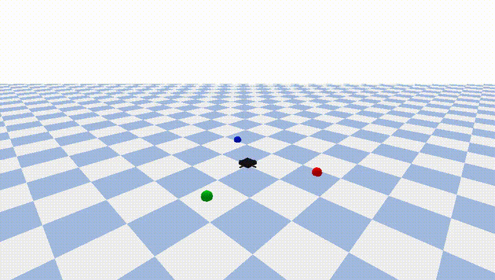

# VLA Drone Agent

一个基于自然语言指令的最小闭环无人机智能体（Vision-Language-Action Agent）。

本项目面向 **VLA（Vision-Language-Action）**、**Embodied Agent（具身智能）** 和 **无人系统自主控制** 方向，实现了一个从自然语言任务输入到无人机动作执行的最小闭环 Demo。

系统能够解析中文或英文任务指令，完成任务规划、目标感知、安全检查、运动控制、状态监测、失败处理以及实验记录，并在 PyBullet 仿真环境中完成自主执行。
## Demo 视频
以下视频展示了系统执行示例指令的过程：

指令：起飞，找到红色目标，飞到它上方1米处悬停5秒，然后降落



完整视频文件见：[outputs/demo.mp4](outputs/demo.mp4)
## 功能特点

- 支持中文、英文自然语言任务指令解析
- 支持规则 Planner 与 LLM Planner 两种规划方式
- 使用 Pydantic action schema 对动作序列进行结构化校验
- 支持工作空间边界与任务安全检查
- 支持颜色目标（Red / Blue / Green）感知
- 支持无人机起飞、移动、悬停、降落等动作控制
- 支持失败检测与自动回退（Fallback）
- 自动保存视频、轨迹、事件日志及实验结果

## 系统流程

整个 Agent 执行流程如下：


示例输入：

```text
起飞，找到红色目标，飞到它上方1米处悬停5秒，然后降落
```

对应 Planner 输出：

```json
[
  {"action": "takeoff", "altitude": 1.5},
  {"action": "search", "target": "red"},
  {"action": "move_above", "target": "red", "height": 1.0},
  {"action": "hover", "duration": 5},
  {"action": "land"}
]
```

## 项目结构

```text
vla-drone-agent/
├── agent/
│   ├── planner.py             # 规则 Planner：中英文指令解析
│   ├── llm_planner.py         # 可选 LLM Planner
│   ├── planner_backend.py     # Planner 后端选择:auto/rule/llm 与 fallback
│   ├── schema.py              # Pydantic action schema 校验
│   ├── safety.py              # 工作空间边界与安全检查
│   └── replanner.py           # 失败后的安全 fallback plan
│
├── perception/
│   ├── color_detector.py      # 颜色目标感知接口
│   └── camera.py              # 相机/观测扩展预留
│
├── sim/
│   ├── world.py               # PyBullet 世界与彩色目标
│   ├── drone.py               # 简化无人机模型
│   ├── controller.py          # 起飞、移动、悬停、降落控制
│   └── recorder.py            # 视频、轨迹与事件日志记录
│
├── experiments/
│   ├── tasks.json             # 10 条自然语言评估任务
│   └── evaluate.py            # 批量评估脚本
│
├── outputs/
│   ├── demo.mp4               # 单任务演示视频
│   ├── trajectory.csv         # 无人机轨迹与控制误差
│   ├── events.jsonl           # Agent Loop 事件日志
│   └── results.csv            # 批量实验结果
│
├── docs/
│   ├── dev_log.md             # 每日开发记录
│   ├── ai_usage.md            # AI 使用说明
│   ├── report.pdf             # 实验报告
│   └── research_note.pdf      # Research Note
│
├── run_demo.py                # 单条自然语言任务 demo 入口与 Agent Loop
├── requirements.txt           # Python 依赖
└── README.md
```

## 环境要求

推荐开发环境：

```
Ubuntu 22.04
Python 3.10+
PyBullet
```

本项目在 Ubuntu 22.04（WSL2）、Python：3.10.6 环境下完成开发与测试。

## 安装

```bash
git clone git@github.com:Litcherry/vla-drone-agent.git
cd vla-drone-agent

python3 -m venv .venv
source .venv/bin/activate

pip install -r requirements.txt
```

## 快速开始

默认采用 `auto` 模式，即：优先调用 LLM Planner；若 LLM 不可用或输出非法，则自动回退到 Rule Planner。

运行 Demo：

```bash
python run_demo.py --task "起飞，找到红色目标，飞到它上方1米处悬停5秒，然后降落"
```

强制使用 Rule Planner：

```bash
python run_demo.py --planner rule --task "起飞，找到红色目标，飞到它上方1米处悬停5秒，然后降落"
```

强制使用 LLM Planner：

```bash
python run_demo.py --planner llm --task "起飞，找到红色目标，飞到它上方1米处悬停5秒，然后降落"
```

注意：`--planner llm` 模式要求已正确配置 LLM API Key。如果 LLM 不可用，该模式会直接报错；若希望 LLM 不可用时自动回退到规则 Planner，请使用默认的 `auto` 模式。

运行结束后，将生成：

```text
outputs/demo.mp4
outputs/trajectory.csv
outputs/events.jsonl
```

## 配置 LLM API

支持 OpenAI-Compatible API。

例如使用阿里云百炼：

```bash
export DASHSCOPE_API_KEY="your_api_key"
export DASHSCOPE_BASE_URL="https://dashscope.aliyuncs.com/compatible-mode/v1"
export DASHSCOPE_MODEL="qwen-plus"
```

随后运行：

```bash
python run_demo.py --planner auto --task "起飞，找到红色目标，飞到它上方1米处悬停5秒，然后降落"
```

若未配置 API Key，则系统自动退化为规则 Planner，不影响项目复现。

## 失败场景测试示例

目标缺失：

```bash
python run_demo.py --planner rule --missing-target red --task "起飞，找到红色目标，飞到它上方1米处悬停5秒，然后降落"
```

安全检查失败：

```bash
python run_demo.py --planner rule --task "take off, move to x=5 y=0 z=1, hover 2 seconds, then land"
```

不支持颜色：

```bash
python run_demo.py --planner rule --task "起飞，找到青色目标，然后降落"
```

## 批量实验评估

运行：

```bash
python experiments/evaluate.py --task-file experiments/tasks.json
```

生成：

```
outputs/results.csv
outputs/eval/
```

当前实验结果：

```
Total tasks: 10
Success rate: 50%
Average duration: 5.48 s
Average final error: 0.0678 m
```

典型失败原因：

```
target_not_found
planning_failed
unsupported_target_color
safety_violation
unparseable_instruction
```

## 测试

运行：

```bash
pytest -q
```

当前覆盖模块：

- Planner
- Schema
- Safety
- World
- Controller
- Perception
- LLM Fallback
- Demo Failure Handling
- Evaluation

## 输出文件

| 文件           | 说明         |
| -------------- | ------------ |
| demo.mp4       | 仿真视频     |
| trajectory.csv | 飞行轨迹     |
| events.jsonl   | 事件日志     |
| results.csv    | 批量实验结果 |

## 当前简化

为了实现最小闭环，本项目进行了如下简化：

- 使用位置控制替代真实四旋翼动力学控制；
- Perception 直接读取仿真环境目标信息，而非 RGB 图像检测；
- LLM Planner 为可选模块，默认保留规则 Planner；
- 失败重规划采用保守策略（悬停后降落）。

## 后续改进方向

- 基于 RGB / Depth 图像实现目标检测；
- 引入更真实的无人机动力学模型；
- 增加 SayCan 风格动作可执行性评分；
- 支持 LLM 自动修复非法规划结果；
- 迁移到真实无人机平台，增加视觉定位、状态估计、避障与飞控接口。