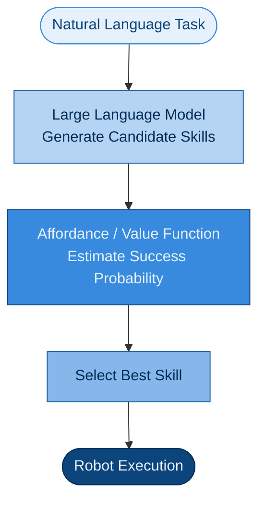

# Research Note：从 SayCan 看语言规划在无人机 Agent 中的可执行性约束

## 1 论文信息

论文名称：**《Do As I Can, Not As I Say: Grounding Language in Robotic Affordances》**

论文链接：https://arxiv.org/abs/2204.01691

项目主页：https://say-can.github.io/

## 2 为什么选择这篇论文

近年来，大语言模型（LLM）在任务规划和自然语言理解方面取得了显著进展，但机器人系统仍然面临一个关键问题——**语言模型能够生成合理的计划，并不意味着机器人能够真正执行这些计划。**SayCan 正是围绕这一问题展开研究。

相比直接利用 LLM 控制机器人，SayCan 提出应当将语言规划能力与机器人当前环境、技能和物理约束结合，使机器人执行"当前能够完成的动作"，而不是简单执行语言模型生成的结果。

本项目实现的是一个语言驱动的无人机 Agent 最小闭环，其整体执行流程与 SayCan 的 Grounded Planning 思想具有较高一致性，因此选择该论文作为主要参考文献。

## 3 SayCan 解决的问题——仅使用传统 LLM 指导机器人的弊端

传统 LLM 可以根据任务描述生成看似合理的高层回复，但这些回复不一定能转化为机器人当前可执行的动作。

比如提问：I spilled my drink, can you help?，让一个语言模型描述如何清理洒在地上的液体，它会给出一段看起来合理的操作流程——也就是说，**大语言模型完全具备提供高层知识，以规划和执行复杂的、时间跨度较长指令的能力。**

**但对于需要在某个具体环境中完成这一任务的特定智能体（例如机器人）来说，这些描述未必真正适用。**因为有可能家里没有吸尘机，机械臂强度或尺寸不足以让机器人具备使用吸尘机清理的能力。

**因此，仅依赖语言模型进行规划容易产生不可执行的计划。**

SayCan 关注的问题可以概括为：如何将语言模型的高层规划能力，与机器人当前环境中的可执行能力结合起来？

对应论文标题 Do As I Can, Not As I Say：机器人应该执行"自己当前能够完成的动作"，而不是盲目执行语言模型建议的动作。

## 4 SayCan 的核心思想

SayCan 的核心在于引入 **Affordance**（可执行性）的概念，将语言模型的规划能力与机器人的实际执行能力通过概率打分机制结合起来。

论文采用语言模型概率与技能价值函数（Value Function）相结合的方式，对候选动作进行评分：
$$
score(skill) = p_{LLM}(skill | task) × p_{affordance}(skill | state)
$$
其中：

- $p_{LLM}(skill | task)$：表示语言模型认为该技能符合当前任务语义的概率，反映**语义合理性（Semantic Relevance）**
- $p_{affordance}(skill | state)$：价值函数（Value Function）对"在当前环境状态下该技能能否成功执行"的评分，表示机器人在当前环境状态下成功执行该技能的概率，反映**物理可执行性（Physical Feasibility）**

系统综合考虑这两个因素，从候选技能中选择得分最高的动作作为下一步执行目标。

整体流程：



该方法使得机器人不会直接执行 LLM 输出，而是在执行前进行环境 Grounding。只有同时满足语义合理性和环境可执行性的动作，才会进入实际执行阶段。

## 5 本项目的借鉴部分

阅读 SayCan 后，我认为其最重要的思想并不是训练和优化 LLM，而是：**语言规划结果不能直接执行，必须经过环境约束和可执行性判断。**

因此，在本项目中，Planner 输出不会直接进入 Controller，而是依次经过：


虽然实现方式更加简单，但体现了 Language → Grounding → Action 的基本思想。

### 5.1 本项目与 SayCan 的对应关系

| SayCan                | 本项目实现                    |
| --------------------- | ----------------------------- |
| Language Model        | Rule Planner / LLM Planner    |
| Skill Proposal        | Action List                   |
| Affordance Evaluation | Schema + Safety + Perception  |
| Robot Skills          | takeoff、move_to、hover、land |
| Execution Feedback    | Agent Loop                    |
| Failure Recovery      | Fallback Replanning           |

虽然没有训练 Affordance Value Function，但仍然通过规则约束实现了动作可执行性的检查。可以认为，本项目实现了一个轻量级的 ”SayCan-style Grounded Planning Demo“。

### 5.2 Grounding 在本项目中的体现

Grounding 的核心思想是：**机器人动作必须结合当前环境进行判断。**

#### 比如：超出工作边界

Planner 输出：

```json
{
    "action":"move_to",
    "position":[5,0,1]
}
```

虽然动作格式正确，但 Safety 模块发现：x = 5，超出工作空间边界。因此系统拒绝执行。

#### 再比如：找不到目标

任务要求：找到红色目标，但环境中红色目标不存在。Planner 本身没有错误，但：Perception → target_not_found:red

Agent Loop 随后启动 Fallback：

```json
[
  {
    "action":"hover",
    "duration":1.0
  },
  {
    "action":"land"
  }
]
```

因此，语言规划只是第一步，真正决定动作执行的是环境状态。这里体现了 Grounded Planning 的思想。

## 6 本项目的简化实现

相比 SayCan，本项目进行了较大程度的简化。

### 6.1 规则化约束代替 Value Function

本项目没有训练 Affordance Value Function，而是采用规则化约束判断动作是否可执行，包括：

- Action Schema；
- 参数合法性；
- 工作空间边界；
- 目标是否存在；
- Controller 是否成功到达目标。

其次，本项目动作空间较小，仅支持：

- takeoff
- search
- move_to
- move_above
- hover
- land

### 6.2 Perception 模块采用环境观测

Perception 模块直接读取 PyBullet 仿真环境中的目标位置，没有实现 RGB 图像检测和三维定位。

### 6.3 Controller 简化控制

Controller 采用简化位置控制，而非真实无人机飞控系统。

### 6.4 重规划保守策略

最后，本项目的 Replanning 采用保守策略，仅执行：

Hover → Land

而没有重新生成完整任务计划。

## 7 如果迁移到真实无人机，还需要哪些能力

如果将该 Demo 部署到真实无人机平台，还需要进一步补充：

- RGB / Depth 感知；
- 目标检测与目标跟踪；
- 图像坐标到世界坐标转换；
- VIO、SLAM 或 GPS 定位；
- PID / MPC 等低层飞控；
- 避障与路径规划；
- Geofence 安全约束；
- 在线任务重规划（Online Replanning）；
- Execution Monitoring；
- Human Override 与 Emergency Stop。

这些能力共同决定了 Agent 在真实环境中的可靠性。

## 8 VLA Agent 方向核心研究难点

结合相关资料和论文，我认为该方向还有以下难点：

### 8.1 机器人感知和动作控制的对齐

真实机器人不能直接获得目标世界坐标，而需要通过 RGB、Depth、LiDAR、SLAM 或状态估计获得目标位置。

VLA 观测到的为二维图像，难点为：如何将图像里的像素坐标，变成真实世界里的三维坐标。这种转换需要：相机标定、深度估计、三维重建、坐标变换等技术。

因此，我认为从图像坐标、语义目标到世界坐标和控制目标之间的转换，是 VLA 落地中的关键问题。

### 8.2 数据稀缺与泛化能力

如果单纯使用强化学习，机器人不断重复学习的成本很高，而且奖励函数很难设计。并且强化学习的泛化能力较差。

采用模仿学习，效率会更高，但现实世界是无限的，当前数据仍旧稀缺。

### 8.3 安全性与实时部署

机器人 AI 的安全性方面要求极高。在真实部署场景中，当语言指令存在歧义、感知出现误差或执行发生偏差时，系统需要具备可靠的异常检测和安全中断机制。

### 8.4 世界模型与预测性规划

根据搜集的相关资料以及了解到的最新世界模型方向，我认为未来的机器人会采用"世界模型（World Model）+ 模仿学习（Imitation Learning）+ VLA Foundation Model + 少量 RL 微调"的混合范式。

世界模型为 VLA Agent 带来了高保真仿真、长时序预见和可扩展数据生成的能力，具身世界模型通过预测复杂环境的时空演化来模拟环境状态，并作为规划可执行动作的基础模型。将世界模型与低层控制进行闭环集成，是当前重点研究方向和难点。